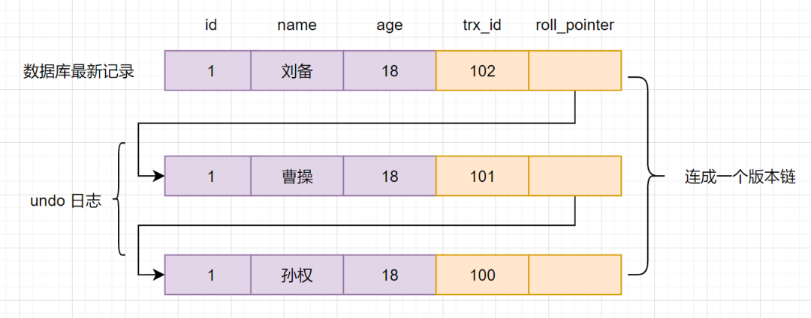
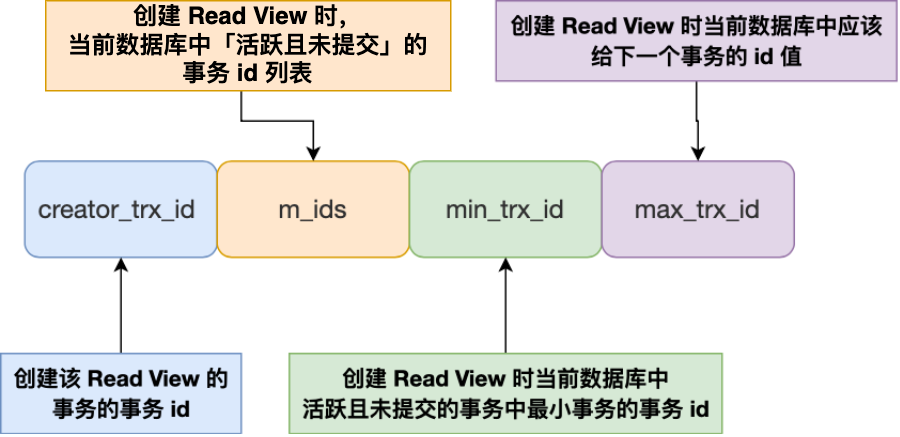
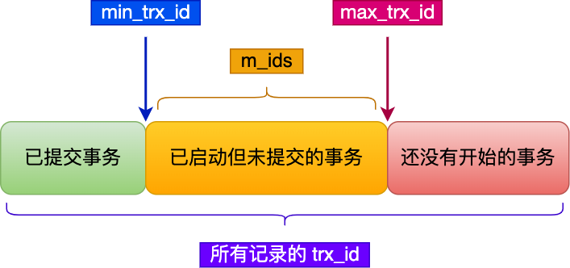
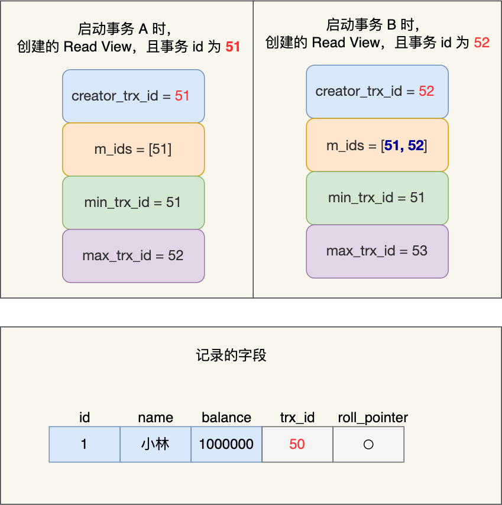
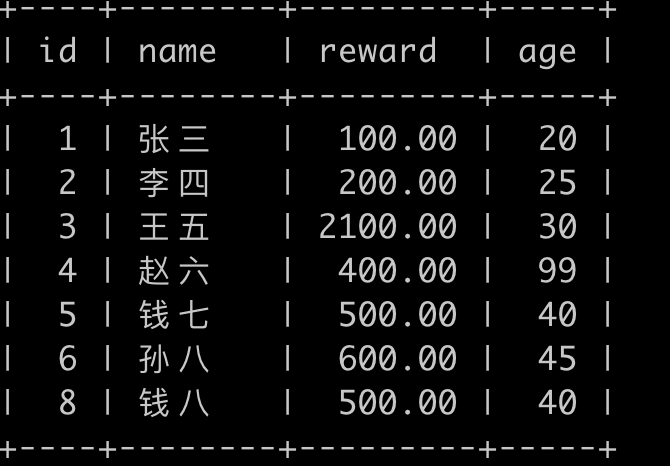
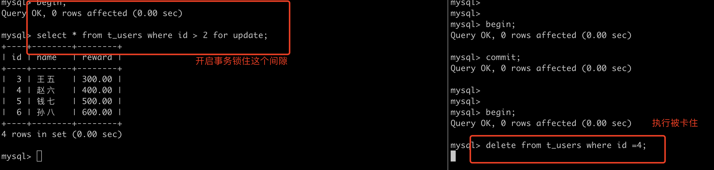
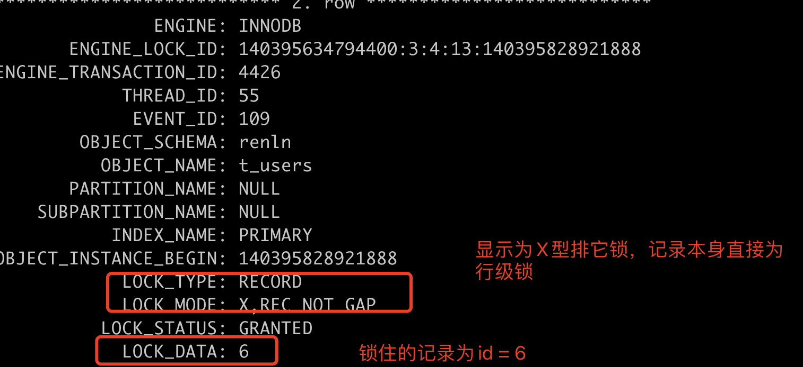

## mysql 锁与事务

[TOC]

#### 1.为什么需要事务

- mysql是直接操作数据库记录，数据是唯一且一致的，必须保证一系列操作是一体的，比如转账场景下，转账业务里的所有数据库的操作是不可分割的，要么全部执行成功 ，要么全部失败，不允许出现中间状态的数据。

#### 2. 事务是怎么实现的

##### 2.1 事务的特性

- A: 原子性：undolog日志
- C：一致性：持久性+原子性+隔离性
- I：隔离性：MVCC多版本控制
- D：持久化：redolog日志

##### 2.2 事务并行

> 并发执行的事务之间的不干扰主要是针对update/insert/del，但是在这些场景下，数据库处理模式（加锁）表现不同，因此也有隔离级别。

##### 2.3 事务并行的影响

1. 数据脏读：修改了事务未保存的数据

   > 假设当前数据库中同时有两个事务并发执行，分别为事务A和事务B，当事务A将数据1更新成2，然后事务B也需要将同一行的数据修改为3，假设事务A执行途中出现错误，无法继续执行，需要回滚数据，那么现在数据中的值将变为1，事务B对数据的修改就会消失，这种现象就是脏写问题。

2. 数据不可重复读：读取了还未提交的数据，然后事务回滚之后，再次读取数据，造成了不一致

   > 假设事务A和事务B并发执行，事务A首先查询某一行的数据，然后事务B对该行数据进行了修改，并将修改后的数据提交了，事务A在第二次查询的时候，就会出现两次查询结果不一样的情况，这种现象就是数据库事务的不可重复读。

3. 数据幻读：两次相同条件的查询期间，满足条件的数据出现了变动

   > 事务A需要使用到user表的数据总量，假设当前user表中共有3条数据，在事务A执行期间，事务B往user表中添加了一条数据，那么事务A下次查询user表中的数据总数时，则会显示为4条，这种现象就是数据库事务中最为神秘的幻读

##### 2.4 事务的隔离级别

> Mysql 对上述四种问题定义了四种隔离级别，从而避免在事务并发执行的时候产生的问题，进而保证数据最终一致性

###### 2.4.1 隔离级别分类

- read uncommitted 读未提交
- read commited 读已提交
- repeatable read 可重复读
- serizlizable 串行化

###### 2.4.2 举个例子

前置动作

```sql
# 设置隔离级别 
SET SESSION TRANSACTION ISOLATION LEVEL $level 
#level 取值如2.5所示
```


| 事务A                       | 事务B             |
| --------------------------- | ----------------- |
| 启动事务，查询得到目标值为1 | 启动事务          |
|                             | 查询得到目标值为1 |
|                             | 将目标值由1改为2  |
| 查询得到值为V1              |                   |
|                             | 提交事务B         |
| 查询得到值为V2              |                   |
| 提交事务A                   |                   |
| 查询得到值V3                |                   |
|                             |                   |

###### 2.4.3 结果分析

>  在不同的隔离级别下，事务A会有哪些不同的返回结果，也就是图里面V1、V2、V3的返回值分别是什么。

- 若隔离级别是“读未提交”， 则V1的值就是2。这时候事务B虽然还没有提交，但是结果已经被A看到了。因此，V2、V3也都是2。
- 若隔离级别是“读提交”，则V1是1，V2的值是2。事务B的更新在提交后才能被A看到。所以， V3的值也是2。
- 若隔离级别是“可重复读”，则V1、V2是1，V3是2。之所以V2还是1，遵循的就是这个要求：事务在执行期间看到的数据前后必须是一致的。
- 若隔离级别是“串行化”，则在事务B执行“将1改成2”的时候，会被锁住。直到事务A提交后，事务B才可以继续执行。所以从A的角度看， V1、V2值是1，V3的值是2。

###### 2.4.5 锁与隔离级别

1. 为什么不能使用加锁的方式实现隔离性

   > 加锁确实好使，可以保证隔离性。比如串行化隔离级别就是加锁实现的。但是频繁的加锁，导致读数据时，没办法修改，修改数据时，没办法读取，大大降低了数据库性能。

2. 如何通过行级锁实现隔离级别（InnoDB支持）

   | 隔离级别       | 读实现方式                                                   | 写实现方式                                                   |
   | -------------- | ------------------------------------------------------------ | ------------------------------------------------------------ |
   | 未提交读（RU） | 事务对当前被读取的数据不加锁；                               | 事务在更新某数据的瞬间（就是发生更新的瞬间），必须先对其加**行级共享锁**，直到事务结束才释放。 |
   | 提交读（RC）   | 事务对当前被读取的数据加**行级共享锁（当读到时才加锁）**，一旦读完该行，立即释放该行级共享锁； | 事务在更新某数据的瞬间（就是发生更新的瞬间），必须先对其加**行级排他锁**，直到事务结束才释放。 |
   | 可重复读（RR） | 事务在读取某数据的瞬间（就是开始读取的瞬间），必须先对其加**行级共享锁**，直到事务结束才释放； | 事务在更新某数据的瞬间（就是发生更新的瞬间），必须先对其加**行级排他锁**，直到事务结束才释放。 |
   | 序列化读（S）  | 事务在读取数据时，必须先对其加**表级共享锁** ，直到事务结束才释放； | 事务在更新数据时，必须先对其加**表级排他锁** ，直到事务结束才释放。 |

3. 锁添加和释放

   | 事务A                                                        | 事务B                                         |
   | ------------------------------------------------------------ | --------------------------------------------- |
   | `begin; update t set i = i + 1 where id =1; update t set i = i + 1 where id =2 ;` |                                               |
   |                                                              | `begin； update t set i = i + 2 where id =1;` |
   | `commit;`                                                    | B 执行语句会发生什么现象？                    |

   两阶段锁协议（单机事务2PL，分布式事务2PC）

   - 事务启动时添加行级锁，并且在扩展阶段会持续加锁，不允许释放锁

   - 事务结束的时候才会释放，并且在释放阶段会持续释放锁，不允许再加锁

     > 补充：不区分mysql中锁的种类，一般是在对记录更新操作或者(select for update、lock in share model)时，会对记录加锁(有共享锁、排它锁、意向锁、gap锁、nextkey锁等等

   - 为什么要使用2PL/PC（锁住热点数据的时间变短，提升效率）

     > https://segmentfault.com/a/1190000038163191

#### 3. 事务隔离性&&并发控制

##### 3.1 悲观式加锁（【读-写冲突】和【写-写冲突】）

> - 悲观锁指的是 采用一种持有悲观消极的态度，默认数据在被外界访问时，必然会产生冲突，所以 在数据处理的整个过程中都采用加锁的状态，保证同一时间 只有一个线程可以访问到数据，实现数据的排他性。
>
> - 通常，数据库的悲观锁是利用数据库本身提供的锁机制去实现的。数据库的悲观并发控制可以解决【读-写冲突】和【写-写冲突】，也即是使用加锁的方式去解决。
> - 主要分为两种
>   - 共享锁，多个事务共享一把锁，用于读数据，不能更改（lock in share mode）
>   - 排他锁，事务之间锁资源互斥，获得锁才能写资源，但是有可能造成锁资源竞争，进而造成死锁（for update  CUD）
> - 适合读少写多的环境，吞吐量较低

##### 3.2 乐观式加锁（【写-写冲突】）

> - 乐观锁指的是外界对数据的操作一般不会造成冲突，所以，并不会去加锁（所以乐观锁不是一把锁），而是在数据进行提交更新的时候，才会正式的对数据的冲突与否进行检测，如果检测发现冲突了，则让返回冲突信息，让用户决定如何去做下一步，比如说重试，直至成功为止；否则，则会直接更新数据。
> - CAS

##### 3.3 MVCC

> - MVCC 的核心思想是在数据库中保存多个版本的数据，每个事务只能看到其启动时的版本，从而避免了读写冲突和锁竞争，提高了并发性能。
>
> - MVCC 的实现方式有多种，其中最常见的是基于快照的 MVCC。在基于快照的 MVCC 中，每个事务在启动时会创建一个快照，用于记录数据库中的当前状态。

#### 4.MVCC【Multi-Version Concurrency Control]

##### 4.1 特点

1.MVCC其实广泛应用于数据库技术，像Oracle,PostgreSQL等也引入了该技术，即适用范围广

2.MVCC并没有简单的使用数据库的行锁，而是使用了**行级锁，row_level_lock**,而**非InnoDB中的innodb_row_lock.**

##### 4.2 基本原理

> MVCC的实现，通过保存数据在某个时间点的快照来实现的。这意味着一个事务无论运行多长时间，在同一个事务里能够看到数据一致的视图。根据事务开始的时间不同，同时也意味着在同一个时刻不同事务看到的相同表里的数据可能是不同的。

- 当前读：每次读取的都是当前最新的数据，但是读的时候不允许写，写的时候也不允许读。
- 快照读：读写不冲突，每次读取的是快照数据，
- tips :
  - 隔离级别Repeatable Read下（默认隔离级别）：有可能读取的不是最新的数据
  - Read Committed隔离级别下：快照读和当前读读取的数据是一样的，都是最新的。

##### 4.3 基本特征

1. 每行数据都存在一个版本，每次数据更新时都更新该版本。
2. 修改时Copy出当前版本随意修改，各个事务之间无干扰。
3. 保存时比较版本号，如果成功（commit），则覆盖原记录；失败则放弃copy（rollback）

##### 4.4 InnoDB存储引擎MVCC的实现策略

1. 在每一行数据中额外保存两个隐藏的列：当前行创建时的版本号和删除时的版本号（可能为空，其实还有一列称为回滚指针，用于事务回滚，不在本文范畴）。这里的版本号并不是实际的时间值，而是系统版本号。每开始新的事务，系统版本号都会自动递增。事务开始时刻的系统版本号会作为事务的版本号，用来和查询每行记录的版本号进行比较。
2. 每个事务又有自己的版本号，这样事务内执行CRUD操作时，就通过版本号的比较来达到数据版本控制的目的

##### 4.5 MVCC下InnoDB的增删改查是怎么实现的

1. 增加

   记录的版本号即当前事务的版本号

   执行一条数据语句：insert into testmvcc values(1,"test");

   假设事务id为1，那么插入后的数据行如下：

   | id   | name | create_version | delete_version |
   | ---- | ---- | -------------- | -------------- |
   | 1    | test | 1              |                |

2. 更新

   在更新操作的时候，采用的是先标记旧的那行记录为已删除，并且删除版本号是事务版本号，然后插入一行新的记录的方式。

   比如，针对上面那行记录，事务Id为2 要把name字段更新

   update table set name= 'new_value' where id=1;

   | id   | name      | create_version | delete_version |
   | ---- | --------- | -------------- | -------------- |
   | 1    | test      | 1              | 2              |
   | 2    | new_value | 2（递增）      |                |

3. 删除

   delete from table where id=1;

   | id   | name      | create_version | delete_version |
   | ---- | --------- | -------------- | -------------- |
   | 3    | new_value | 2              | 3(递增)        |

\4. 查询

> 从上面的描述可以看到，在查询时要符合以下两个条件的记录才能被事务查询出来

1. RR级别
   1. 删除版本号未指定或者**删除版本号大于当前事务版本号**，即查询事务开启后确保读取的行未被删除。(即上述事务id为2的事务查询时，依然能读取到事务id为3所删除的数据行)
   2. **创建版本号 小于或者等于 当前事务版本号** ，就是说记录创建是在当前事务中（等于的情况）或者在当前事务启动之前的其他事物进行的commit
2. RC级别
   1. 不限制创建版本号和删除版本号，每次读取都是获取最新提交记录

##### 4.6 可见性

###### 4.6.1 版本链



1. trx_id 自增事务id
2. roll_pointer 回滚指针 记录undo_log的数据地址，根据undo log（记录数据被修改前的数据），回滚支持一致性

###### 4.6.2 视图 Read View

1. **Read View是什么呢？** 它就是事务执行SQL语句时，产生的读视图。实际上在innodb中，每个SQL语句执行前都会得到一个Read View。

2. **Read View有什么用呢？** 它主要是用来做可见性判断的，即判断当前事务可见哪个版本的数据

3. 属性

   1. m_ids:当前系统中那些活跃(未提交)的读写事务ID, 它数据结构为一个List。
   2. min_limit_id:表示在生成Read View时，当前系统中活跃的读写事务中最小的事务id，即m_ids中的最小值。
   3. max_limit_id:表示生成Read View时，系统中应该分配给下一个事务的id值。
   4. creator_trx_id: 创建当前Read View的事务ID


4. 匹配规则

> 如果记录的 trx_id 值小于 Read View 中的 min_trx_id 值，表示这个版本的记录是在创建 Read View **前**已经提交的事务生成的，所以该版本的记录对当前事务**可见**。

1. 如果记录的 trx_id 值大于等于 Read View 中的 max_trx_id 值，表示这个版本的记录是在创建 Read View **后**才启动的事务生成的，所以该版本的记录对当前事务**不可见**。
2. 如果记录的 trx_id 值在 Read View 的 min_trx_id 和 max_trx_id 之间，需要判断 trx_id 是否在 m_ids 列表中：
   1. 如果记录的 trx_id **在** m_ids 列表中，表示生成该版本记录的活跃事务依然活跃着（还没提交事务），所以该版本的记录对当前事务**不可见**。
   2. 如果记录的 trx_id **不在** m_ids列表中，表示生成该版本记录的活跃事务已经被提交，所以该版本的记录对当前事务**可见**。

**这种通过「版本链」来控制并发事务访问同一个记录时的行为就叫 MVCC（多版本并发控制）。**



##### 4.7  适用场景

1. MVCC手段只适用于Mysql隔离级别中的读已提交（Read committed）和可重复读（Repeatable Read）.
2. 读未提交，没有创建版本，串行读写都是串行，不会有冲突

##### 4.8 可重复读如何工作

>  **可重复读隔离级别是启动事务时生成一个 Read View，然后整个事务期间都在用这个 Read View**。

假设事务 A （事务 id 为51）启动后，紧接着事务 B （事务 id 为52）也启动了，那这两个事务创建的 Read View 如下:

> 小林的银行账户为1000000



接着，在可重复读隔离级别下，事务 A 和事务 B 按顺序执行了以下操作：

| 执行动作                                                   | 可看到的范围                                                 | 备注                                                         |
| ---------------------------------------------------------- | ------------------------------------------------------------ | ------------------------------------------------------------ |
| A事务启动B事务启动                                         | A:create_trx_id = 51mids = [51]min_trx_id = 51max_trx_id = 52 | B:create_trx_id = 52mids = [51,52]min_trx_id = 51max_trx_id = 53 |
| 事务 B 读取小林的账户余额记录，读到余额是 100 万；         | B:trx_id = 50 < min_trx_id = 51                              | B可以查询到记录                                              |
| 事务 A 将小林的账户余额记录修改成 200 万，并没有提交事务； | A：m_ids  = [51], min_trx_id = 51 max_trx_id =52             |                                                              |
| 事务 B 读取小林的账户余额记录，读到余额还是 100 万；       |                                                              | B进行查询，m_ids = [51,52],mix_trx_id = 51,max_trx_id = 53trx_id = 51  在min ～max之间，判断trx_id在mids中，那就不会读取这个版本的记录，而是去寻找旧版本记录 |
| 事务 A 提交事务；                                          | trx_id = 51完成提交                                          |                                                              |
| 事务 B 读取小林的账户余额记录，读到余额依然还是 100 万；   | B查询到当前记录对应的trx_id仍然是51 在m_ids中，那么还是不会读取，只会向前寻找，保证了事务前后看到的范围是一致的 |                                                              |


#### 5. Mysq隔离级别与幻读

##### 5.1 实现可重复读的两种方式

> MySQL InnoDB 引擎的默认隔离级别虽然是「可重复读」，但是它很大程度上避免幻读现象（并不是完全解决了）

- 快照读：

  - MVCC利用版本和隔离性，保证了事务前后看到的数据都是一致的
  - 具体实现：版本链+undolog日志

- 当前读：

  - 通过next-key-lock（记录锁+间隙锁）解决了幻读

  

##### 5.2 行级锁

| 隔离级别                                     | 行级锁                                                       | 作用范围                                                     | 条件变化                                                     |
| -------------------------------------------- | ------------------------------------------------------------ | ------------------------------------------------------------ | ------------------------------------------------------------ |
| 读已提交                                     | 记录锁Record Lock                                            | 锁住一条记录，X型锁                                          | id 列必须为唯一索引列或主键列，否则上述语句加的锁就会变成临键锁(有关临键锁下面会讲)。同时查询语句必须为精准匹配（=），不能为 >、<、like等，否则也会退化成临键锁。 |
| 可重复读                                     | Record Lock                                                  | 如果一条记录加了S型记录锁后，那么其他事务也是可以继续对该记录添加S型记录锁，但是不能+X型记录锁如果一个事务对一条记录添加了X型记录锁后，那么其他事务不能继续添加S型锁和X型锁 |                                                              |
| Gap Lock 间隙锁（只存在于可重复读隔离级别 ） | 间隙锁，锁定一个范围，但是个开区间，不能锁住记录本身间隙锁虽然区分X型和S型，但是没有什么区别，都是为了限制间隙之间不能插入幻影记录 | **间隙锁**存在于**非唯一索引**中，锁定**开区间**范围内的一段间隔。 |                                                              |
| Next-Key Lock 临键锁 = 记录锁+ 间隙锁        | 锁住一个范围，并且锁住记录本身                               | 每个数据行上的**非唯一索引列**上都会存在一把**临键锁**，当某个事务持有该数据行的**临键锁**时，会锁住一段**左开右闭区间**的数据。临键锁只与 非唯一索引列 有关，在 唯一索引列（包括主键列）上不存在临键锁。 |                                                              |

#### 6. 间隙锁实现过程

##### 6.1 前置操作

```
# 数据库建表
CREATE TABLE t_users (
  id INT(11) NOT NULL AUTO_INCREMENT,
  name VARCHAR(50) NOT NULL,
  reward DECIMAL(10,2) NOT NULL DEFAULT '0.00',
  PRIMARY KEY (id)
) ENGINE=InnoDB DEFAULT CHARSET=utf8mb4;
# 插入测试数据
INSERT INTO t_users (name, reward) VALUES ('张三', 100.00);
INSERT INTO t_users (name, reward) VALUES ('李四', 200.00);
INSERT INTO t_users (name, reward) VALUES ('王五', 300.00);
INSERT INTO t_users (name, reward) VALUES ('赵六', 400.00);
INSERT INTO t_users (name, reward) VALUES ('钱七', 500.00);
INSERT INTO t_users (name, reward) VALUES ('孙八', 600.00);
```

##### 6.2 问题复现

	



1. 执行过程

   >  select * from t_users where id >= 6 for update;

2. 日志输出结果

   >  select \* from performance_schema.data_locks\G**
   - 三条行级锁，第一条为记录锁

   - 第二条为（6，8]间隙锁

   - 第三条为（8，+∞]

   

##### 6.3 特殊情况

1. 查询条件所归属的字段无索引覆盖和索引覆盖的区别

2. 如果不是唯一索引还会添加间隙表吗
3. 删除操作会影响间隙锁吗
4. 1间隙锁与死锁

